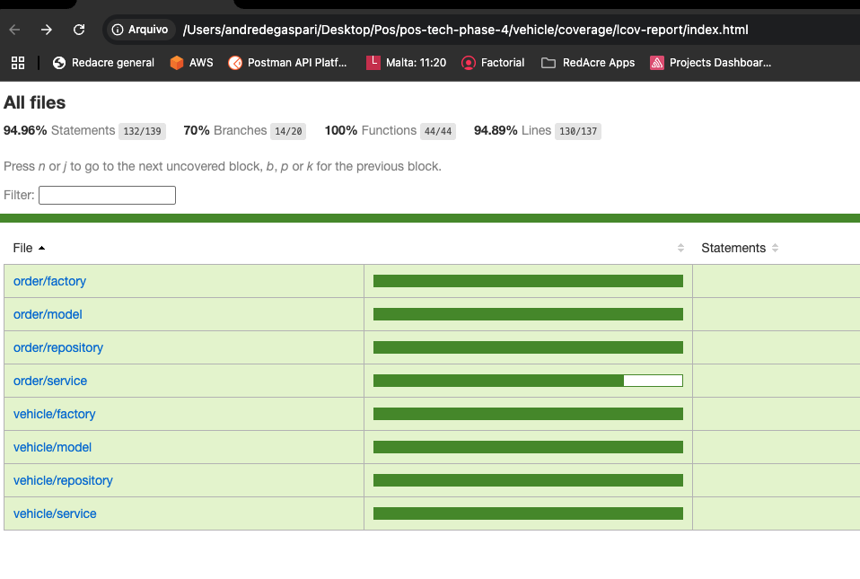
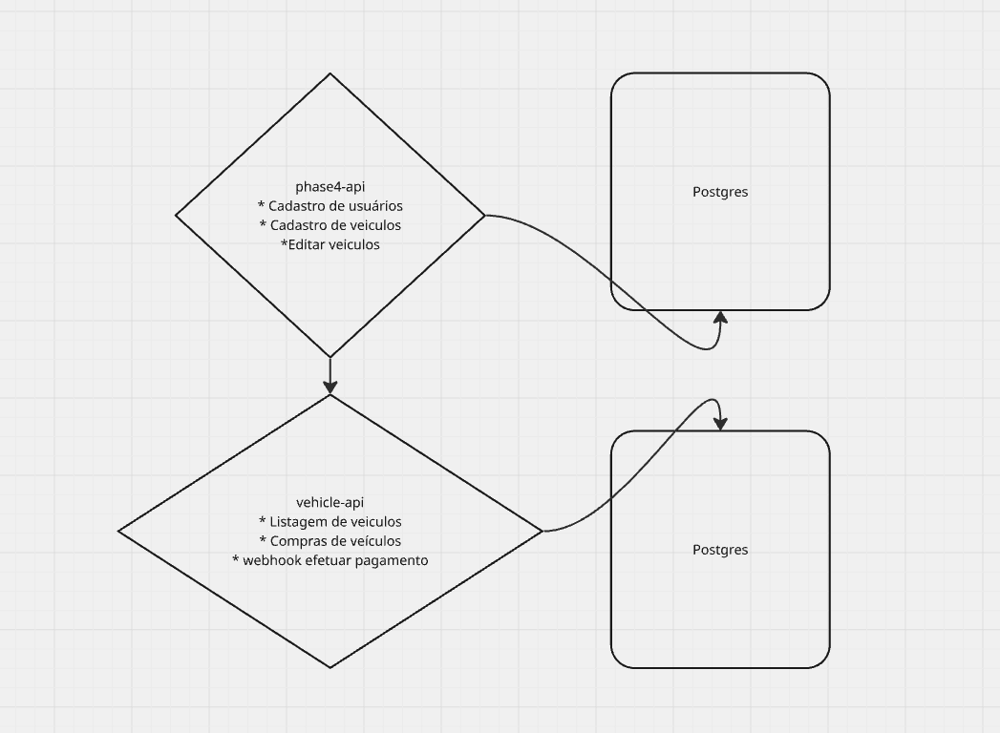

## O que é a vehicle api.

Uma solução que atende as seguintes necessidades de um negócio de venda de carros:

• Cadastrar um veículo para venda (Marca, modelo, ano, cor, preço);
• Editar os dados do veículo;
• Permitir a reserva de compra do veículo.
• Permitir a finalização da compra do veículo via webhook.
• Listagem de veículos à venda, ordenada por preço, do mais barato para o mais caro;
• Listagem de veículos vendidos, ordenada por preço, do mais barato para o mais caro.

## Como rodar a aplicação

# Pre requisitos

1 - Docker e docker compose

# Criar network

1 - Rodar o comando abaixo para que os dois microserviços tenham uma network compartilhada:  
docker network create microservices-network

# Rodando a aplicação

1 - Criar um arquivo .env a partir do arquivo .env.example
2 - rodar o comando docker compose up na raiz do projeto

## Curls para teste

# Listar veiculos

curl --location 'http://localhost:3001/vehicles?isAvailable=true'

# Criar ordem de compra

curl --location --request POST 'http://localhost:3001/orders' \

# Finalizar compra

curl --location 'http://localhost:3001/orders/finish' \
--header 'Content-Type: application/json' \

--data '{
"id":"e8486af0-1e40-4561-9daa-6842bed92217",
"paymentInfo": success

}'

## Coverage

## Arquitetura

